# Binary Search
Binary Search is a searching algorithm that searches a **sorted** array for a key by **comparing the middle element** of an array to the key element, sub-divide the array into 2 equal halves and utlize the comparison to dictate which half of the array would be searched for the key element if still not found at the middle of the array

## Time and Space Complexity
- Time Complexity:
    | Best Time (&#937;)    | Average Time (&#952;)     | Worst Time (O)    |
    | ---                   | ---                       | ---               |
    | 1                     | log(n)                    | log(n)            |
- Space Complexity:
    O(n)

## Flowchart
### Binary Search Algorithm

```mermaid
flowchart
    Start((Start))
    VarInitFunc[Set variables to keep track of the<br>left end and right end of the array or subarray]
    CompareLeftLTERight{Is<br>Left end <= Right End}
    ReturnNotFound((Return not found))
    
    subgraph LoopLeftLTERight [While Left End <= Right End]
        direction TB
        VarInitMid[Set a variable to store the middle point of the array or subarray]
        CompareKeyWithMiddle{Compare the key element with<br>the element at the middle}
        ReturnMid((Return the middle<br>position/index))
        SubarrayLeftHalf[Take left half of the<br>array as a subarray]
        SubarrayRightHalf[Take Right half of the<br>array as a subarray]
        
        VarInitMid --> CompareKeyWithMiddle
        %% Comparision
            CompareKeyWithMiddle -->|Lesser| SubarrayLeftHalf
            CompareKeyWithMiddle -->|Equal| ReturnMid
            CompareKeyWithMiddle -->|Greater| SubarrayRightHalf
    end
    
    

    Start --> VarInitFunc
    VarInitFunc --> CompareLeftLTERight
    %% CompareLeftLTERight
        CompareLeftLTERight -->|Yes🟢| LoopLeftLTERight
        CompareLeftLTERight -->|No🔴| ReturnNotFound
    LoopLeftLTERight --> CompareLeftLTERight
```

### Main Function
