# Linear Search
Linear Search is a searching algorithm that iterates through a linear data structure and compares each node of it to the key

## Time and Space Complexity
- Time Complexity
    | Best Time (&#937;)    | Average Time (&#952;)     | Worst Time (O)    |
    | ---                   | ---                       | ---               |
    | 1                     | n                         | n                 |
- Space Complexity
    O(n)

## Flowchart
### Linear Search Algorithm

```mermaid
flowchart
    %% Node definition
    Start([Start])
    VarInit[Initialize initial variables]
    CheckPointerWithinOfBounds{"
        Node pointer points
        within structure
    "}
    NextNode["
        Navigate to
        next node
    "]
    CompareKeyToNode{"
        Compare
        Key to Node
    "}
    ReturnKey(["
        Return
        index/position
        of Node
    "])
    ReturnKeyNotFound(["
        Return
        Key not Found
    "])

    Start --> VarInit["
        Initialize variable(s) that will point to
        each node of the data structure
    "]
    VarInit --> CheckPointerWithinOfBounds
    
    %% CheckPointerWithinOfBounds
        CheckPointerWithinOfBounds -->|Yes🟢| CompareKeyToNode
        CheckPointerWithinOfBounds --->|No🔴| ReturnKeyNotFound


    %% CompareKeyToNode
        CompareKeyToNode --> |Are same🟢| ReturnKey
        CompareKeyToNode --> |Are different🔴| NextNode
    
    NextNode --> CheckPointerWithinOfBounds
```

### Main function
