# Linear Search
Linear Search is a searching algorithm that iterates through a linear data structure and compares each node of it to the key

## Time and Space Complexity
- Time Complexity
    | Best Time ()  | Average Time ()   | Worst Time(O) |
    | ---           | ---               | ---           |
    | O(1)          | O(n)              | O(n)          |
- Space Complexity
    O(n)

## Flowchart
### Linear Search Algorithm

```mermaid
flowchart
    %% Node definition
    Start((Start))
    VarInit[Initialize initial variables]
    CheckPointerWithinOfBounds{Node pointer points  <br />within structure}
    NextNode[Navigate to<br>next node]
    CompareKeyToNode{Compare Key to Node}
    ReturnKey((Return<br />index/position<br />of Node))
    ReturnKeyNotFound((Return<br/>Key not Found))

    Start --> VarInit[Initialize variable#40;s#41; that will point to<br>each node of the data structure]
    VarInit --> CheckPointerWithinOfBounds
    
    %% CheckPointerWithinOfBounds
        CheckPointerWithinOfBounds -->|Yes| CompareKeyToNode
        CheckPointerWithinOfBounds -->|No| ReturnKeyNotFound


    %% CompareKeyToNode
        CompareKeyToNode --> |Is same🟢| ReturnKey
        CompareKeyToNode --> |Is different🔴| NextNode
    
    NextNode --> CheckPointerWithinOfBounds
```

### Main function
