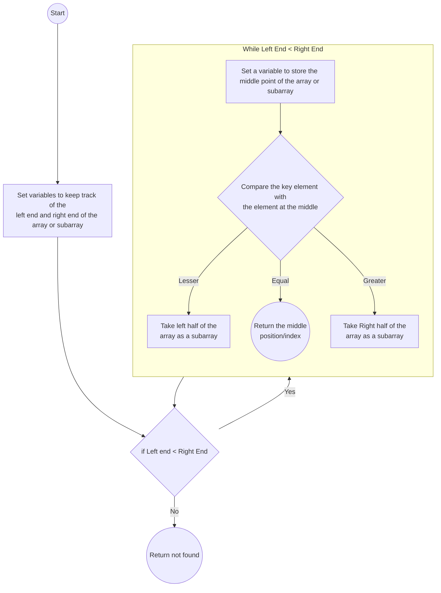
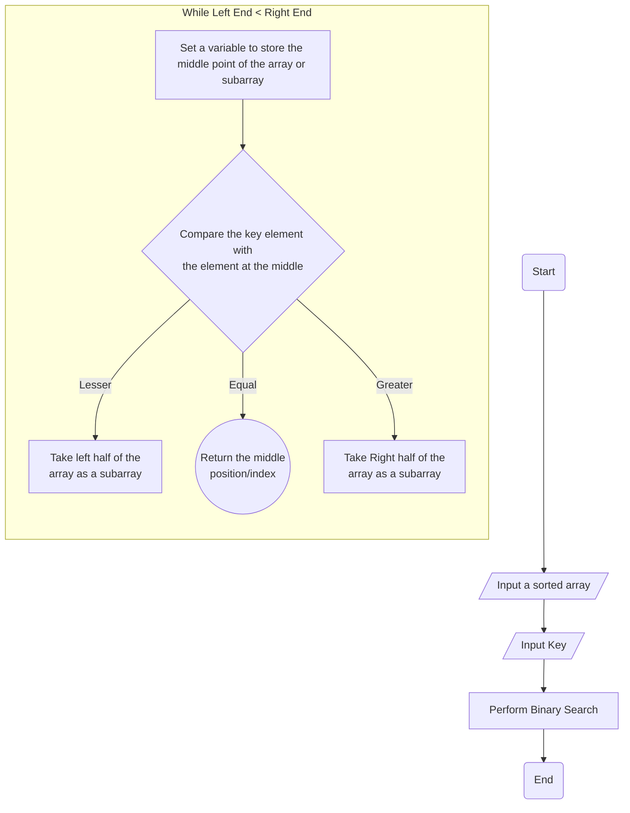

# Binary Search
Binary Search is a searching algorithm that searches a **sorted** array for a key by **comparing the middle element** of an array to the key element, each time taking half of the array, which  potentially contain the key element

## Time and Space Complexity
- Time Complexity:
    | Best Time ()  | Average Time ()   | Worst Time(O) |
    | ---           | ---               | ---           |
    | 1             | log(n)            | log(n)        |
- Space Complexity:
    O(n)

## Flowchart
### Binary Search Algorithm

### Main Function
