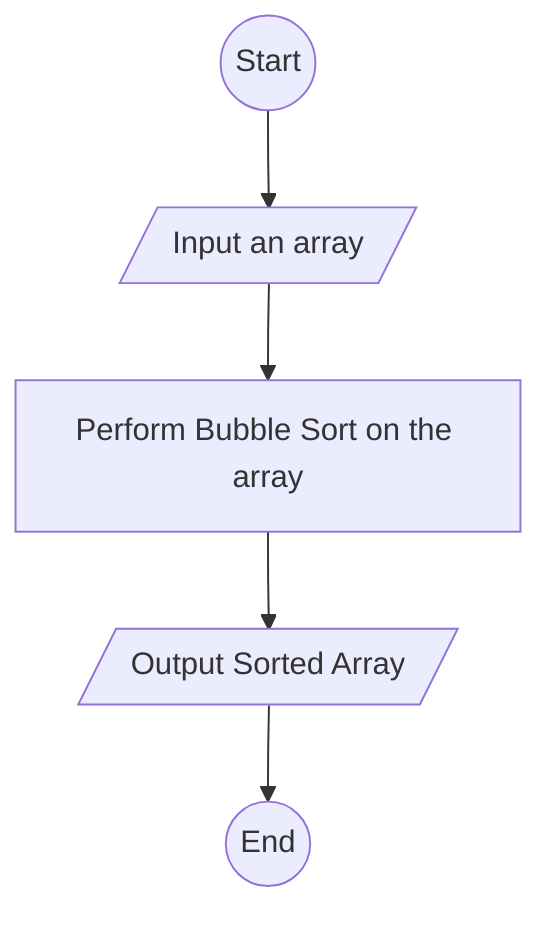

# Bubble Sort
Bubble sort is a sorting algorithm that sorts an array by iterating through each element in the array and comparing the element to its next immediate neighbour and swapping between them based on the comparison of their magnitudes

## Time and Space Complexity
- Time Complexity
    | Best Time (&#937;)    | Average Time (&#952;)     | Worst Time (O)    |
    | ---                   | ---                       | ---               |
    | n                     | n2             | n2     |
- Space Complexity
    O(n)

## Flowchart
### Bubble Sort Algorithm
<small>*To be added*</small>
### Main function
